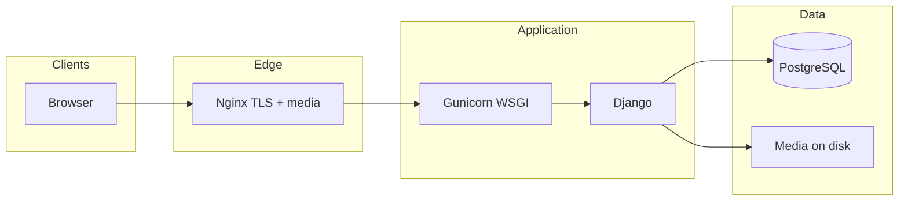

# Radhe Cars

Production-oriented **used-car marketplace** for **Gujarat, India** (Ahmedabad area). Customers browse approved inventory, submit **buy** and **sell** inquiries, use a **wishlist**, and contact the dealership. **Staff** manage listings, brands/models, customers, and inquiries in a dedicated **`/admin-panel/`** (separate from Django’s `/admin/`).

---

## Table of contents

1. [Features](#features)  
2. [Tech stack](#tech-stack)  
3. [Architecture](#architecture)  
4. [Repository layout](#repository-layout)  
5. [Prerequisites](#prerequisites)  
6. [Local development](#local-development)  
7. [Environment variables](#environment-variables)  
8. [Frontend (Tailwind CSS)](#frontend-tailwind-css)  
9. [Database](#database)  
10. [Product data & listing conventions](#product-data--listing-conventions)  
11. [Staff: CSV import & export](#staff-csv-import--export)  
12. [Authentication](#authentication)  
13. [URLs overview](#urls-overview)  
14. [Deployment](#deployment)  
15. [Operations checklist](#operations-checklist)  
16. [Troubleshooting](#troubleshooting)  
17. [License](#license)  
18. [Contributing](#contributing-for-new-developers)

---

## Features

### Public site

| Area | Description |
|------|-------------|
| **Home** | Hero carousel, featured/recent cars, body-type filter (AJAX), testimonials |
| **Inventory** | `/cars/` — filters (brand, price, fuel, transmission, year, etc.) |
| **Car detail** | Gallery, specs, wishlist, **Contact us** can pre-select the listing |
| **Contact** | Inquiry form; optional linked car (approved listings only) |
| **Sell** | Multi-step flow (brand → year → **month** → model → variant → Gujarat RTO → … → photos); listings go to staff **Sell car inquiries** |
| **Auth** | Email/password + **Google** (django-allauth) |
| **Wishlist** | Per-user saved cars |

**Header:** Logo, search, **Sell Car** (CTA), **Buy Car**, wishlist (with count badge when logged in), account, phone.

### Staff (`/admin-panel/`)

Dashboard, **Cars** (CRUD, bulk actions, CSV export), **Brands** / **Models**, **Customers**, **Wishlist** activity, **Buy car inquiries** (contact form), **Sell car inquiries**, **CSV import / export**. Uses `is_staff`. Sidebar highlights **only the current section** (e.g. Buy vs Sell inquiries are not both active).

### Django admin (`/admin/`)

Standard Django admin for models; optional for low-level fixes.

---

## Tech stack

| Layer | Choice |
|-------|--------|
| **Runtime** | Python 3.11+ (see `runtime.txt`) |
| **Framework** | Django 5.2 |
| **Database** | **PostgreSQL** (`DATABASE_URL` or `DB_*`) |
| **Auth** | django-allauth (email + Google OAuth) |
| **Static** | WhiteNoise (prod); optional Nginx for `/media/` |
| **WSGI** | Gunicorn |
| **Frontend** | Server-rendered templates, **Tailwind** (local build), vanilla JS |

---

## Architecture



- HTTPS often terminates at Nginx; Django uses `X-Forwarded-Proto` when `USE_X_FORWARDED_HEADERS` is set.  
- **SQLite is not supported** — PostgreSQL is required.

---

## Repository layout

```
.
├── cars/                    # App: models, views, admin_panel, migrations
├── radhe_cars/              # Settings, root URLconf, WSGI, middleware
├── templates/               # cars/, admin_panel/, partials/
├── static/                  # Built CSS/JS (commit tailwind.css or CI-build)
├── static_src/              # Tailwind source
├── media/                   # Uploads (car images) — not secrets
├── deploy/lightsail/          # Example Nginx + systemd
├── manage.py
├── requirements.txt
├── package.json
├── .env.example
└── README.md
```

---

## Prerequisites

- Python 3.11+  
- PostgreSQL 12+  
- Node.js + npm (Tailwind build)  
- Google OAuth credentials (web app) for social login  

---

## Local development

### 1. Clone and virtualenv

```bash
git clone <repo-url> radhe-cars
cd radhe-cars
python -m venv venv
```

Activate: **Windows** `venv\Scripts\activate` · **Linux/macOS** `source venv/bin/activate`

### 2. Dependencies

```bash
pip install -r requirements.txt
```

### 3. Environment

```bash
cp .env.example .env
```

Set at minimum: `SECRET_KEY`, `DEBUG=True`, `ALLOWED_HOSTS`, PostgreSQL (`DATABASE_URL` or `DB_*`), `GOOGLE_CLIENT_ID` / `GOOGLE_CLIENT_SECRET`.

### 4. CSS

```bash
npm install
npm run build:css
```

Use `npm run watch:css` while editing UI.

### 5. Database

```bash
python manage.py migrate
python manage.py createsuperuser
```

Configure **Sites** in `/admin/sites/site/` for OAuth redirects if testing Google login.

### 6. Run

```bash
python manage.py runserver
```

Open **http://127.0.0.1:8000**

---

## Environment variables

| Variable | Purpose |
|----------|---------|
| `SECRET_KEY` | Required |
| `DEBUG` | `True` locally; `False` in production |
| `ALLOWED_HOSTS` | Comma-separated hosts |
| `DATABASE_URL` | PostgreSQL URI (e.g. Supabase) |
| `DATABASE_SSL_REQUIRE` | Default `true` for remote TLS |
| `DB_*` | Alternative to `DATABASE_URL` |
| `GOOGLE_CLIENT_ID`, `GOOGLE_CLIENT_SECRET` | OAuth |
| `CSRF_TRUSTED_ORIGINS` | Extra origins behind HTTPS |
| `USE_X_FORWARDED_HEADERS` | Behind reverse proxy |
| `SECURE_SSL_REDIRECT` | Production HTTPS |

Details: **`.env.example`**.

---

## Frontend (Tailwind CSS)

| Item | Path / command |
|------|----------------|
| Source | `static_src/tailwind.input.css` |
| Output | `static/css/tailwind.css` |
| Build | `npm run build:css` |
| Watch | `npm run watch:css` |

---

## Database

- Configured in `radhe_cars/settings.py`: `DATABASE_URL` or `DB_*`.  
- **No SQLite** — missing config raises `ImproperlyConfigured`.  
- After pulling code with model changes: **`python manage.py migrate`**.

---

## Product data & listing conventions

These match the **`Car`** model and staff/public UIs.

### Fuel type (`fuel_type`)

**Stored values** (exact strings):

| Value | Notes |
|-------|--------|
| `Petrol` | |
| `Diesel` | |
| `Petrol + CNG` | Stored with spaces; **not** the legacy code `CNG` alone |
| `Electric` | |

Display uses the same strings (e.g. car detail, card specs). The sell form and CSV import accept **aliases** (`CNG`, `Petrol+CNG`, `Petrol + CNG`, etc.) and normalize to **`Petrol + CNG`**.

### Manufacturing month (`model_month`)

- Optional integer **1–12** in the database.  
- **Customers** see **abbreviated month + year** (e.g. **Jan 2021**) in **Make year** via `make_year_display`.  
- **Staff / Django admin:** dropdown **Jan–Dec** (not raw 1–12).  
- **Public sell flow:** month step uses **Jan–Dec** labels; title line does not duplicate the month.

### Sell flow: Gujarat registration

When the seller selects **Gujarat**, RTO options come from a fixed list (**GJ-01 … GJ-38**) in `templates/cars/sell_car.html` (`GJ_RTOS`).

---

## Staff: CSV import & export

Access: **`/admin-panel/csv/import/`** (and export link on the same page).

### Required columns

`title`, `brand`, `model`, `year`, `price`, `mileage`

Brand and model names must match existing records (**case-insensitive** for lookup).

### Optional columns

| Column | Valid values / notes |
|--------|----------------------|
| `id` | Existing car PK → **update** that row |
| `model_month` | `1`–`12` **or** `Jan`–`Dec` (abbrev.) |
| `variant` | Text |
| `fuel_type` | **`Petrol`**, **`Diesel`**, **`Electric`**, **`Petrol + CNG`** — or aliases **`CNG`**, **`Petrol+CNG`**, **`Petrol + CNG`** (normalized on import) |
| `transmission` | **`MT`** (manual) or **`AT`** (automatic) — not `MANUAL` / `AUTOMATIC` |
| `body_type` | `Hatchback`, `Sedan`, `SUV`, `MUV`, `Luxury` |
| `ownership` | **`1st Owner`**, **`2nd Owner`**, … — not `1st` / `2nd` alone |
| `status` | **`PENDING`**, **`APPROVED`**, … (uppercase codes) — not `pending` |
| `city`, `color`, `description`, `is_featured`, `original_price` | As documented in the import UI |

**Tip:** Use **Export** to download a CSV in the correct shape; edit and re-import.

### Encoding

UTF-8 (with BOM accepted). See validation errors on the preview step for row-level fixes.

---

## Authentication

- **django-allauth**: email login + **Google**.  
- Redirect URI example: `https://yourdomain.com/accounts/google/login/callback/`  
- Adapter: `cars.account_adapter` (`ACCOUNT_ADAPTER`).

---

## URLs overview

| Path | Notes |
|------|--------|
| `/` | Home |
| `/cars/` | List + filters |
| `/cars/<id>/` | Detail |
| `/contact/` | Contact / inquiry |
| `/sell/` | Sell flow |
| `/accounts/` | allauth |
| `/admin-panel/` | Staff panel (`/admin-panel/login/`) |
| `/admin/` | Django admin |
| `/health/` | Health check |

---

## Deployment

1. `DEBUG=False`, strong `SECRET_KEY`, `ALLOWED_HOSTS`, `CSRF_TRUSTED_ORIGINS`  
2. PostgreSQL reachable  
3. `python manage.py migrate`  
4. `python manage.py collectstatic --noinput`  
5. Serve **`MEDIA_ROOT`** (Nginx or object storage)  
6. Gunicorn + Nginx + TLS  
7. Google OAuth production redirect URIs  

**Lightsail examples:** `deploy/lightsail/` (`nginx-site.conf.example`, `gunicorn.service.example`).

```bash
sudo systemctl daemon-reload
sudo systemctl restart <your-gunicorn.service>
```

---

## Operations checklist

| Task | Command / note |
|------|------------------|
| Migrations | `python manage.py migrate` after deploy |
| Static | `python manage.py collectstatic --noinput` |
| Staff user | `createsuperuser` + `is_staff` |
| CSS | `npm run build:css` before release if templates/classes changed |

---

## Troubleshooting

| Symptom | Suggestion |
|---------|------------|
| DB `ImproperlyConfigured` | Set `DATABASE_URL` or full `DB_*` |
| Google OAuth misconfigured | Set client ID/secret; check Sites + redirect URIs |
| CSRF on HTTPS | `CSRF_TRUSTED_ORIGINS`; `X-Forwarded-Proto` from proxy |
| Stale CSS | `npm run build:css` + collectstatic |
| CSV import validation errors | Match **exact** codes (see [Staff: CSV import](#staff-csv-import--export)); use **Export** as a template |

---

## License

© Radhe Cars. All rights reserved.

---

## Contributing (for new developers)

1. Read **`.env.example`** before first run.  
2. Never commit **`.env`** or production secrets.  
3. Follow existing patterns in `cars/` for models, views, and forms.  
4. Run **migrations** when models change; update **`.env.example`** and this README when behavior or env vars change.  
5. Rebuild Tailwind (`npm run build:css`) when changing classes under `templates/` / `static_src/`.
