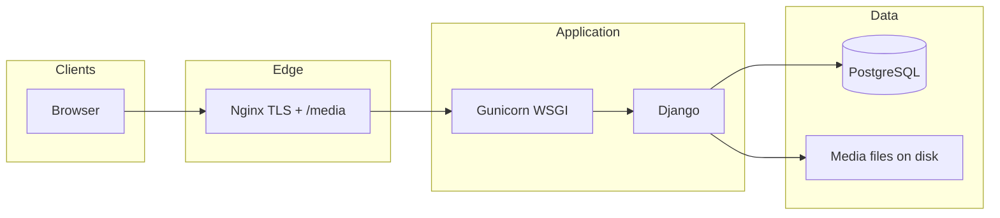

# Radhe Cars

A production-oriented **used-car marketplace** for **Gujarat, India** (Ahmedabad area). Customers browse approved inventory, submit **buy** and **sell** inquiries, use a **wishlist**, and contact the dealership. **Staff** manage listings, brands/models, customers, and inquiries through a dedicated **admin panel** (separate from Django’s built-in `/admin/`).

---

## Table of contents

1. [Features](#features)  
2. [Tech stack](#tech-stack)  
3. [Architecture](#architecture)  
4. [Repository layout](#repository-layout)  
5. [Prerequisites](#prerequisites)  
6. [Local development](#local-development)  
7. [Environment variables](#environment-variables)  
8. [Frontend (Tailwind CSS)](#frontend-tailwind-css)  
9. [Database](#database)  
10. [Authentication](#authentication)  
11. [URLs overview](#urls-overview)  
12. [Deployment](#deployment)  
13. [Operations checklist](#operations-checklist)  
14. [Troubleshooting](#troubleshooting)  
15. [License](#license)

---

## Features

### Public site

| Area | Description |
|------|-------------|
| **Home** | Hero carousel, featured/recent cars, body-type filter (AJAX), testimonials |
| **Inventory** | `/cars/` — filters (brand, price, fuel, transmission, year, etc.) |
| **Car detail** | Gallery, specs, wishlist, **Contact us** pre-selects the listing on the contact form |
| **Contact** | Inquiry form; optional **linked car** for staff (approved listings only) |
| **Sell** | Multi-step listing with images; flows into staff **sell car inquiries** |
| **Auth** | Email/password signup/login and **Google** (django-allauth) |
| **Wishlist** | Per-user saved cars |

### Staff (`/admin-panel/`)

Staff-only UI for day-to-day operations: dashboard, **cars** (CRUD, bulk actions, CSV export), **brands** / **models**, **customers**, **wishlist** activity, **buy car inquiries** (contact form), **sell car inquiries**, **CSV import**, etc. Uses Django permissions (`is_staff`).

### Django admin (`/admin/`)

Standard Django admin for models; use for low-level data fixes if needed.

---

## Tech stack

| Layer | Choice |
|-------|--------|
| **Runtime** | Python 3.11+ (see `runtime.txt` for pinned example) |
| **Framework** | Django 5.2 |
| **Database** | **PostgreSQL only** (local `DB_*` or `DATABASE_URL`, e.g. Supabase) |
| **Auth** | django-allauth (email + Google OAuth) |
| **Static files** | WhiteNoise (production); optional Nginx for `/media/` |
| **WSGI** | Gunicorn |
| **Frontend** | Server-rendered templates, **Tailwind CSS** (built locally), vanilla JS |

---

## Architecture



- **HTTPS** is typically terminated at Nginx; Django trusts `X-Forwarded-Proto` when `USE_X_FORWARDED_HEADERS` is enabled (default in production).  
- **SQLite is not supported** — settings require PostgreSQL configuration.

---

## Repository layout

```
.
├── cars/                    # Main application (models, views, forms, admin_panel)
├── radhe_cars/            # Project settings, root URLconf, WSGI, middleware
├── templates/             # Global + app templates (cars/, admin_panel/, partials/)
├── static/                # Built CSS, JS, assets (commit built tailwind.css or CI-build)
├── static_src/            # Tailwind input CSS source
├── media/                 # User uploads (car images) — not for secrets
├── deploy/lightsail/      # Example Nginx + systemd unit for VPS deploys
├── manage.py
├── requirements.txt
├── package.json           # npm scripts for Tailwind build
├── .env.example           # Copy to .env — never commit real secrets
└── README.md
```

---

## Prerequisites

- **Python** 3.11+ (3.10+ may work; project targets 3.11)
- **PostgreSQL** 12+ (local or remote URI)
- **Node.js** + **npm** (only to build Tailwind CSS)
- **Google Cloud** OAuth credentials (web application) for login — required by `settings.py`

---

## Local development

### 1. Clone and virtualenv

```bash
git clone <your-repo-url> radhe-cars
cd radhe-cars
python -m venv venv
```

**Windows:** `venv\Scripts\activate`  
**Linux/macOS:** `source venv/bin/activate`

### 2. Install Python dependencies

```bash
pip install -r requirements.txt
```

### 3. Environment file

```bash
cp .env.example .env
```

Edit `.env` at minimum:

- `SECRET_KEY` — generate, e.g.  
  `python -c "from django.core.management.utils import get_random_secret_key; print(get_random_secret_key())"`
- `DEBUG=True`
- `ALLOWED_HOSTS=localhost,127.0.0.1`
- **Database:** either `DATABASE_URL=postgresql://...` **or** `DB_HOST`, `DB_NAME`, `DB_USER`, `DB_PASSWORD` (and optional `DB_PORT`)
- `GOOGLE_CLIENT_ID` and `GOOGLE_CLIENT_SECRET` from Google Cloud Console (OAuth consent + OAuth 2.0 Client IDs)

### 4. Build CSS (required for styled pages)

```bash
npm install
npm run build:css
```

For active UI work:

```bash
npm run watch:css
```

### 5. Database

Create an empty PostgreSQL database matching your `.env`, then:

```bash
python manage.py migrate
python manage.py createsuperuser   # optional: Django admin + staff access
```

Set **Sites** in Django admin (`/admin/sites/site/`) to your local domain if you test OAuth redirects.

### 6. Run the server

```bash
python manage.py runserver
```

Open **http://127.0.0.1:8000**

---

## Environment variables

| Variable | Purpose |
|----------|---------|
| `SECRET_KEY` | **Required.** Django cryptographic signing |
| `DEBUG` | `True` locally; `False` or omit in production |
| `ALLOWED_HOSTS` | Comma-separated hostnames (defaults include production domain in code) |
| `DATABASE_URL` | Single PostgreSQL URI (e.g. Supabase pooler) — preferred in production |
| `DATABASE_SSL_REQUIRE` | Default `true` for remote TLS |
| `DB_HOST`, `DB_NAME`, `DB_USER`, `DB_PASSWORD`, `DB_PORT` | Alternative to `DATABASE_URL` for local Postgres |
| `GOOGLE_CLIENT_ID`, `GOOGLE_CLIENT_SECRET` | **Required** — Google OAuth |
| `CSRF_TRUSTED_ORIGINS` | Extra comma-separated origins (merged with production HTTPS defaults) |
| `USE_X_FORWARDED_HEADERS` | Default `true` when `DEBUG=False` — behind Nginx |
| `SECURE_SSL_REDIRECT` | Default `true` in production unless Nginx handles HTTPS only |

See **`.env.example`** for comments and Supabase notes.

---

## Frontend (Tailwind CSS)

- **Source:** `static_src/tailwind.input.css`  
- **Output:** `static/css/tailwind.css` (referenced by `templates/base.html`)  
- **Build:** `npm run build:css`  
- **Watch:** `npm run watch:css`  

After CSS changes, rebuild before commit or add a CI step.

---

## Database

- Configured in `radhe_cars/settings.py`: **`DATABASE_URL`** (via `dj-database-url`) **or** discrete `DB_*` variables.  
- **No SQLite** — missing DB config raises `ImproperlyConfigured`.  
- Optional **IPv4 preference** for some Supabase hostnames (`_prefer_ipv4_for_supabase`).

---

## Authentication

- **django-allauth** with **email** login and **Google** provider.  
- Redirect URIs must include your domain, e.g.  
  `https://yourdomain.com/accounts/google/login/callback/`  
- Custom behavior may live in `cars.account_adapter` (`ACCOUNT_ADAPTER`).

---

## URLs overview

| Path | Notes |
|------|--------|
| `/` | Home |
| `/cars/` | List + filters |
| `/cars/<id>/` | Detail |
| `/contact/` | Contact / inquiry |
| `/sell/` | Sell flow |
| `/accounts/` | allauth (login, signup, social, etc.) |
| `/admin-panel/` | Staff panel (login under `/admin-panel/login/`) |
| `/admin/` | Django admin |
| `/health/` | Lightweight health check (root URLconf) |

---

## Deployment

### Generic production checklist

1. `DEBUG=False`, strong `SECRET_KEY`, correct `ALLOWED_HOSTS` and `CSRF_TRUSTED_ORIGINS`  
2. PostgreSQL reachable; `DATABASE_URL` or `DB_*` set  
3. `python manage.py migrate`  
4. `python manage.py collectstatic --noinput`  
5. **Media:** serve `MEDIA_ROOT` at `MEDIA_URL` (Nginx `alias` or object storage — not WhiteNoise)  
6. **Gunicorn** (example): `gunicorn radhe_cars.wsgi:application --bind 127.0.0.1:8001`  
7. **Nginx** reverse proxy + TLS (e.g. Let’s Encrypt)  
8. Google OAuth **Authorized redirect URIs** for production domains  

### AWS Lightsail / Ubuntu

Example configs live under **`deploy/lightsail/`** (`nginx-site.conf.example`, `gunicorn.service.example`). After editing a **systemd** unit file:

```bash
sudo systemctl daemon-reload
sudo systemctl restart radhe-cars.service   # or your unit name
```

---

## Operations checklist

| Task | Command / note |
|------|----------------|
| Migrations | `python manage.py migrate` |
| Static files | `python manage.py collectstatic --noinput` |
| Create staff user | `createsuperuser` then grant staff or use your onboarding process |
| CSS rebuild | `npm run build:css` |

---

## Troubleshooting

| Symptom | Suggestion |
|---------|------------|
| `ImproperlyConfigured` for DB | Set `DATABASE_URL` or full `DB_*` set in `.env` |
| `ImproperlyConfigured` for Google | Set `GOOGLE_CLIENT_ID` and `GOOGLE_CLIENT_SECRET` |
| CSRF errors on POST (HTTPS) | Add origin to `CSRF_TRUSTED_ORIGINS`; ensure proxy forwards `X-Forwarded-Proto` |
| Stale CSS | Run `npm run build:css` and redeploy / `collectstatic` |
| systemd “unit changed” warning | Run `sudo systemctl daemon-reload` after editing unit files |

---

## License

© Radhe Cars. All rights reserved.

---

## Contributing (for new developers)

1. Read **`.env.example`** end-to-end before first `runserver`.  
2. Never commit **`.env`** or production secrets.  
3. Match existing patterns in `cars/` for models/views/forms.  
4. Run **migrations** when models change; document new env vars in **`.env.example`** and this README.
